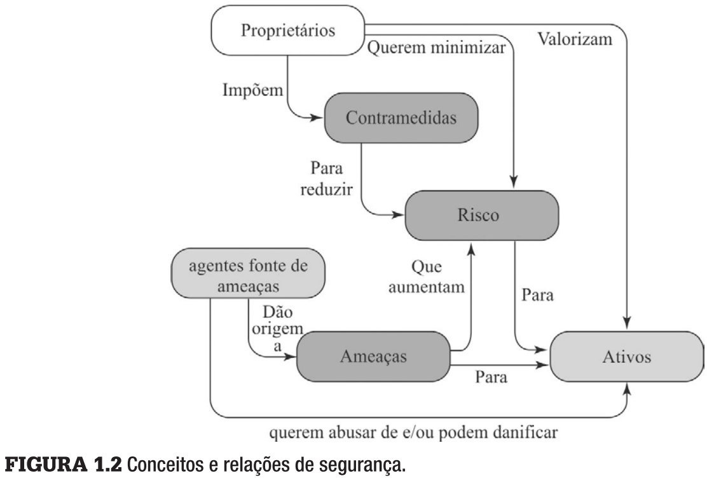

# Segurança da Informação (UFF)

Resumo baseado em (Stallings and Brown, 2013).

Stallings, W. and Brown, L. (2013). Segurança de Computadores. 2ª ed. Elsevier.

## Capítulo 1

### 1.1 Conceitos de segurança de computadores

#### Uma definição de segurança de computadores

**Requisitos de Segurança (Tríade CID)**

- **Confidencialidade**
  - Confidencialidade de Dados (autenticação)
  - Privacidade (autorização)

- **Integridade (modificações autorizadas, ñ-repúdio, autenticidade)**
  - Integridade de Dados
  - Integridade de Sistemas

- **Disponibilidade**

***Extra***
  - Autenticidade
  - Determinação de responsabilidade
    - Responsabilização
    - Registro de atividades
    - Rastreabilidade (não repúdio)

#### Exemplos

**Baixo**: Afeta parcialmente os ativos.

**Moderado**: Afeta significantemente os ativos.

**Alto**: Afeta totalmente os ativos.

- Confidencialidade
  - Alto: Nota de alunos
  - Moderado: Matrícula
  - Baixo: Lista de estudantes
- Integridade
  - Alto: Registros médicos
  - Moderado: Fórum na web
  - Baixo: Votação anônima
- Disponibilidade
  - Alto: Autenticação de Sistemas Críticos
  - Moderado: Boletim Universitário
  - Baixo: Lista Telefonica

#### Os desafios da segurança de computadores

1. Posicionamento físico e lógico dos mecanismos de segurança;
2. Atacante precisa encontrar apenas uma vulnerabilidade, enquanto o projetista deve tentar encontrar todas e eliminá-las;
3. Benefício da segurança só é percebido após uma falha de segurança;
4. Geralmente adicionado após o sistema estar completo, ao invés de ser pensado desde a criação;
5. Segurança forte atrapalha a operação eficiente e amigável ao usuário de um sistema.

#### Um modelo para segurança de computadores

- Ativos
  - *Hardware* (computadores, servidores)
  - *Software* (sistema operacional, aplicações)
  - Dados (arquivos, bancos de dados, senhas)
  - Rede (enlaces, roteadores)
- Vulnerabilidades
  - Corromper
  - Vazar
  - Tornar indisponível
- Ameaça
  - Explorar vulnerabilidade
  - Um potencial dano à segurança
- Ataque (ameaça executada)
  - Ataque ativo (alteração)
    - Repetição
    - Personificação
    - Modificação de mensagem
    - Negação de serviço
  - Ataque passivo (leitura)
  - Ataque interno (usuário legítimo)
  - Ataque externo (usuário não autorizado)
- Contramedida
  - Meio utilizado para lidar com um ataque à segurança
  - Impedir ataque
  - Detectar ataque
    - Recuperar de ataque
- Risco
  - Mensuração de ameaça
- Política de Segurança
  - Regras que regulamentam como um sistema provê serviços de segurança.

### 1.2 Ameaças, Ataques e Ativos

#### Ameaças e Ataques

- Revelação não autorizada (confidencialidade)
  - Exposição
  - Interceptação
  - Inferência
  - Intrusão
- Fraude (integridade)
  - Personificação
  - Falsificação
  - Retratação (ou repúdio)
- Disrupção (disponibilidade, integridade)
  - Incapacitação (disponibilidade)
  - Corrupção (integridade)
  - Obstrução (disponibilidade)
- Usurpação (integridade)
  - Apropriação indevida
  - Utilização indevida

#### Ameaças e Ativos

- *Hardware*
  - Dano ao equipamento (disponibilidade)
  - Roubo (disponibilidade, confidencialidade)
- *Software*
  - Remoção de código (disponibilidade)
  - Cópia não autorizada (confidencialidade)
  - Modificação de código (integridade)
- Dados
  - Remoção de arquivo (disponibilidade)
  - Leitura não autorizada (confidencialidade)
  - Modificação de arquivo (integridade)
- Rede
  - Destruição de mensagens (disponibilidade, ativo)
  - Leitura dos dados trafegados (confidencialidade, passivo)
  - Modificação de mensagens (integridade, ativo)

### 1.3 Requisitos Funcionais de Segurança

Contramedidas, medidas técnicas ou de gerenciamento.

Técnicas
- Controle de Acesso
- Identificação e Autenticação
- Proteção de Sistemas e Comunicações
- Integridade de Sistemas e Informações

Requisitos

- Controle de acesso
- Conscientização e treinamento
- Auditoria e responsabilidade
- Avaliações de certificação, credenciamento e segurança
- Gerenciamento de configuração
- Planejamento de contingência
- Identificação e autenticação
- Resposta a incidentes
- Manutenção
- Proteção da mídia
- Proteção física e ambiental
- Planejamento
- Segurança de pessoal
- Avaliação de risco
- Aquisição de sistemas e serviços
- Proteção de sistemas e comunicações
- Integridade de sistemas e informações

### 1.4 Uma Arquitetura de Segurança para Sistemas Abertos

# Outros

Ameaças e Ataques
- Tipos
- Exemplos
- Categorias (ativos)

Requisitos Funcionais

Resumo do X.800 p/ OSI

Tendências
- Ameaças
- Contramedidas
